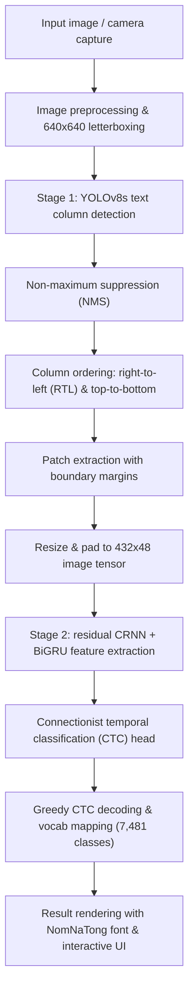

# NomLens

An advanced, on-device AI-powered OCR and document scanner application designed specifically for recognizing historical Vietnamese **Hán-Nôm** scripts (chữ Hán & chữ Nôm).

[](https://www.android.com)
[](https://kotlinlang.org)
[](https://developer.android.com/jetpack/compose)
[](https://www.tensorflow.org/lite)
[](https://pytorch.org)
[](https://www.kaggle.com/datasets/quandang/nomnaocr)

---

## Table of contents

- [Overview](#-overview)
- [Key Features](#-key-features)
- [End-to-End Pipeline](#-end-to-end-pipeline)
- [Machine Learning Models](#-machine-learning-models)
  - [1. Text Column Detector (YOLOv8s)](#1-text-column-detector-yolov8s)
  - [2. Text Recognizer (Residual CRNN + BiGRU + CTC)](#2-text-recognizer-residual-crnn--bigru--ctc)
  - [Dataset & Data Source](#dataset--data-source)
- [Project Architecture](#-project-architecture)
- [Installation & Setup](#-installation--setup)
- [Model Training & Export](#-model-training--export)
- [Tech Stack](#-tech-stack)
- [Acknowledgments](#-acknowledgments)

---

## Overview

**NomLens** addresses the challenge of digitizing, reading, and preserving centuries of Vietnamese cultural heritage recorded in **Hán-Nôm** manuscripts, woodblocks, stele inscriptions, and genealogical records.

Due to the complex, dense structure of vertical Sino-Vietnamese columns, archaic ideographs, and historical reading conventions (Right-to-Left, Top-to-Bottom), modern standard OCR solutions (like Tesseract or generic Latin OCR) fail on Hán-Nôm texts. 

**NomLens** provides a complete, 100% on-device AI system that detects individual text columns in historical documents, processes them according to traditional reading order, and accurately transcribes over 7,400+ distinct Hán-Nôm characters without requiring an internet connection.

---

## Key features

- **Live camera & document scanner**: Seamless document capture with tap-to-focus, zoom control, flash support, and gallery import via modern Android CameraX.
- **100% on-device & offline OCR**: Optimized TensorFlow Lite (TFLite) execution using multi-threaded CPU inference. Zero server roundtrips, ensuring total privacy and offline field usability.
- **Historical reading order preservation**: Automatically sorts detected text columns from **Right-to-Left (RTL)** and **Top-to-Bottom**, matching traditional Vietnamese and East Asian vertical document structure.
- **Authentic typography rendering**: Ships with the bundled `NomNaTong-Regular.ttf` font to correctly render rare and extended Hán-Nôm Unicode glyphs (CJK Ideographs Extension A, B, C, etc.) without missing glyph placeholders (`□`).
- **Interactive bounding box canvas**: Overlays detection boxes directly onto the scanned document, allowing users to tap on individual columns to inspect corresponding transcripts and cropped patches.
- **Character-level confidence metrics**: Displays per-character recognition confidence, CTC decoding details, and raw character indexes.
- **Archive & history management**: Automatically saves scans and recognized transcripts to local storage, with full copy-to-clipboard, image sharing, and search capabilities.
- **Tunable model thresholds**: Live settings dialog to configure detection confidence thresholds and IoU (Intersection-over-Union) suppression parameters in real-time.

---

## End-to-end pipeline

The app uses a modular, two-stage computer vision and sequence recognition pipeline:



### Pipeline steps:

1. **Image preprocessing**: The input image is converted to RGB and letterboxed to $640 \times 640$ pixels while maintaining aspect ratio, normalized to $[0.0, 1.0]$.
2. **Text column detection**: The YOLOv8s detector outputs candidate boxes $[c_x, c_y, w, h, \text{score}]$.
3. **NMS & coordinate mapping**: Candidates undergo Non-Maximum Suppression (default IoU threshold = $0.45$, confidence threshold = $0.15$) and are mapped back to original image dimensions.
4. **Spatial column sorting**: Bounding boxes are sorted by X-center descending (Right-to-Left) and Y-min ascending:
   $$\text{Order} = \text{SortBy}(\text{centerX} \downarrow, \text{yMin} \uparrow)$$
5. **Column normalization**: Each detected column is cropped with adaptive boundary margins and resized/padded onto a $432 \text{ (Height)} \times 48 \text{ (Width)} \times 3 \text{ (RGB)}$ canvas with white background padding.
6. **Sequential recognition**: The CRNN processes the $432 \times 48 \times 3$ column into 54 vertical timesteps across a 7,481-token vocabulary.
7. **Greedy CTC decoding**: Consecutive duplicate tokens are collapsed and blank padding tokens (`[PAD]`, index 0) are eliminated to generate the final text sequence.

---

## Models

The solution integrates two purpose-built deep learning models trained from scratch on historical Hán-Nôm documents.

### 1. Text column detector (YOLOv8s)

- **Model type**: Single-stage Object Detector based on **Ultralytics YOLOv8s** (Small).
- **Task**: Document layout analysis — localizing dense vertical text columns in aged, noisy, and stained manuscripts.
- **Input tensor**: `[1, 3, 640, 640]` (Float32 / INT8, normalized to $[0, 1]$).
- **Output tensor**: `[1, 5, 8400]` ($c_x, c_y, w, h, \text{confidence}$).
- **Training method**:
  - **Pre-training / architecture**: YOLOv8s initialized with CSPDarknet backbone and PAN-FPN neck.
  - **Dataset split**: 85% Train, 15% Validation extracted from page-level annotations.
  - **Augmentations**: Color space perturbation ($\text{HSV}_h=0.05, \text{HSV}_s=0.8, \text{HSV}_v=0.6$), small-angle rotation ($\pm 5.0^\circ$), scaling ($0.2$), and strictly **no horizontal flipping** (`fliplr=0.0`) to avoid mirroring vertical columns.
  - **Optimizer & hyperparameters**: 50 Epochs, batch size 16, image size 640.
  - **Quantization**: Exported to LiteRT / TensorFlow Lite with post-training INT8 / Float32 quantization (~11.5 MB for INT8, ~44.7 MB for Float32).

---

### 2. Text recognizer (Residual CRNN + BiGRU + CTC)

- **Model type**: Deep Convolutional Recurrent Neural Network (**Residual CRNN x CTC**).
- **Task**: Sequential optical character recognition of vertical Hán-Nôm text lines.
- **Input tensor**: `[1, 432, 48, 3]` (Height: 432, Width: 48, Channels: 3).
- **Output tensor**: `[1, 54, 7481]` (54 vertical timesteps $\times$ 7,481 vocabulary classes).
- **Architecture details**:
  - **Residual CNN backbone**: Stem convolution ($3 \to 64$) followed by 4 Residual stages with batch normalization, ReLU activations, and dropout.
  - **Custom vertical pooling**: Utilizes asymmetric pooling (`MaxPool2d(2, 2)` for stages 1-2, and `MaxPool2d(2, 1)` for stage 3) to downsample width to 12 while preserving 54 vertical sequence slices.
  - **Learned width projection**: Replaces heuristic pooling with a learned `Conv2d(512, 512, kernel_size=(1, 12))` + `BatchNorm` layer to collapse spatial width into a 1D sequence tensor $(N, 54, 512)$.
  - **Recurrent context modeling**: 2-layer Bidirectional GRU (`BiGRU`, hidden size = 256, dropout = 0.2), outputting 512 bidirectional context features.
  - **Transcription head**: Linear projection layer from 512 to 7,481 logits.
- **Training method**:
  - **Loss function**: PyTorch `CTCLoss(blank=0, zero_infinity=True)`.
  - **Optimizer**: AdamW ($\text{LR} = 1\times 10^{-3}$, weight decay = $1\times 10^{-4}$).
  - **Scheduler**: `OneCycleLR` with cosine annealing.
  - **Regularization**: Early stopping (patience = 5) with best model checkpointing.
  - **Vocabulary**: 7,481 classes (`[PAD]` blank token + 7,480 Hán-Nôm characters compiled in `vocab.txt`).
  - **Export pipeline**: PyTorch `.pt` $\to$ ONNX $\to$ `onnx2tf` $\to$ TensorFlow Lite Float32 / INT8 (`recognise_model.tflite`).

---

### Dataset & data source

Both models are trained on the public **NomNaOCR** dataset:

- **Dataset link**: [Kaggle: NomNaOCR Dataset by Quan Dang](https://www.kaggle.com/datasets/quandang/nomnaocr)
- **Dataset contents**:
  - `Pages/`: High-resolution historical document scans from traditional Vietnamese manuscripts.
  - `Raw/`: Detailed JSON annotation files specifying polygon shapes and bounding coordinates for text columns.
  - `Patches/`: Extracted text column crops along with ground truth transcriptions (`All.txt` and `Validate.txt`).
  - `NomNaTong-Regular.ttf`: The official font developed by the Vietnamese Nom Preservation Foundation (*Hội Bảo tồn di sản chữ Nôm*).

---

## Installation & setup

### Prerequisites

- **Android Studio**: Ladybug (2024.2.1) or newer
- **JDK**: Java 17
- **Android SDK**:
  - `minSdk`: **26** (Android 8.0 Oreo)
  - `targetSdk` / `compileSdk`: **35** (Android 15)
- **Physical Device or Emulator** with camera support.

### Steps to build and run

1. **Clone the repository**:
   ```bash
   git clone https://github.com/quannnguyen2009/NomLens.git
   cd NomLens
   ```

2. **Verify Model Assets**:
   Ensure that the model files and font exist in `app/src/main/assets/`:
   - `detect_model.tflite`
   - `recognise_model.tflite`
   - `vocab.txt`
   - `NomNaTong-Regular.ttf`

   *(These files are already included in the repository).*

3. **Build and install via Gradle**:
   ```bash
   # Build debug APK
   ./gradlew assembleDebug

   # Install directly to a connected Android device
   ./gradlew installDebug
   ```

4. Alternatively, open the project in **Android Studio** and click **Run ▶**.

---

## Model training & export

If you wish to retrain the models on updated datasets or fine-tune them:

### 1. Training the detector
Open and execute `nomna-detect.ipynb` in [Kaggle](https://www.kaggle.com/) with GPU enabled:
1. Attach the [quandang/nomnaocr](https://www.kaggle.com/datasets/quandang/nomnaocr) dataset.
2. Run data preparation cells to generate YOLO formatted labels from raw JSON annotations.
3. Train the YOLOv8s model with `model.train()`.
4. Export the resulting PyTorch weights to LiteRT/TFLite:
   ```python
   from ultralytics import YOLO
   model = YOLO("runs/detect/NomNaOCR_Detection/.../weights/best.pt")
   model.export(format="litert", quantize=8) # or quantize=False for float32
   ```

### 2. Training the recognizer
Open and execute `nomna-recognise.ipynb` in Kaggle:
1. Load training transcripts and column crops from `Patches/`.
2. Train the PyTorch `CRNN` architecture with `CTCLoss` and `AdamW`.
3. Export the trained model to ONNX and convert to TFLite via `onnx2tf`:
   ```bash
   pip install onnx onnx2tf tensorflow
   ```
   ```python
   import torch
   torch.onnx.export(
       model,
       dummy_input,
       "crnn.onnx",
       input_names=["input"],
       output_names=["output"],
       dynamic_axes=None
   )
   ```
   ```bash
   onnx2tf -in crnn.onnx -coion -output_signature_defs
   ```

4. Place the generated `.tflite` files into `app/src/main/assets/`.

---

## Tech stack

- **Core & UI**: [Kotlin 2.0](https://kotlinlang.org/), [Jetpack Compose](https://developer.android.com/jetpack/compose), [Material 3](https://m3.material.io/)
- **Camera integration**: [AndroidX CameraX](https://developer.android.com/training/camerax) (Lifecycle, Camera2, View)
- **On-device inference**: [TensorFlow Lite](https://www.tensorflow.org/lite) (`org.tensorflow:tensorflow-lite`, `tensorflow-lite-support`)
- **Asynchronous execution**: Kotlin Coroutines & Kotlin Flow
- **Image processing & loading**: Android Graphics (`Bitmap`, `Canvas`), [Coil](https://coil-kt.github.io/coil/)
- **Machine learning & training**: [PyTorch](https://pytorch.org/), [Ultralytics YOLOv8](https://docs.ultralytics.com/), [ONNX](https://onnx.ai/), [onnx2tf](https://github.com/PINTO0309/onnx2tf), OpenCV, NumPy, Pandas

---

## Acknowledgments

- **Dataset creator**: Quan Dang for publishing the [NomNaOCR Dataset](https://www.kaggle.com/datasets/quandang/nomnaocr) on Kaggle.
- **Font & glyph standards**: [Vietnamese Nôm Preservation Foundation](https://www.nomfoundation.org/) (*Hội Bảo tồn Di sản chữ Nôm*) for the `NomNaTong` open font and character definitions.
